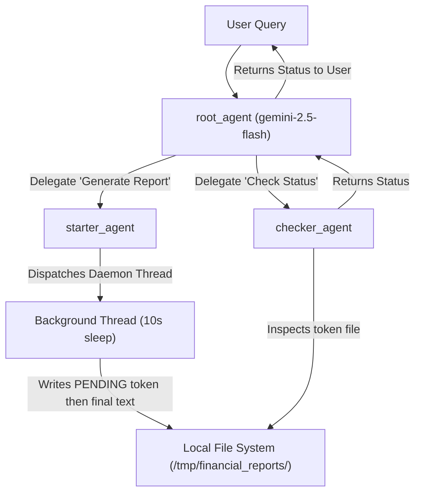

# Asynchronous, Non-Blocking Multi-Agent Workflows

This guide examines the design pattern implemented in `long_running_agent/agent.py` and `long_running.py`. It showcases how to leverage the **Google Agent Development Kit (ADK)** to orchestrate a hierarchical, multi-agent network that dispatches and tracks long-running background tasks (e.g., generating intensive financial reports) asynchronously without blocking the conversational interface.

---

## 🏗️ Architecture Design

Standard LLM agent interactions are synchronous: the user asks a question, the agent executes a tool (which may take minutes), and the user is left waiting for a response. 

The **Non-Blocking Hierarchical Agent Pattern** resolves this by splitting responsibilities across a root agent and specialized sub-agents, using the file system as an external state repository.



---

## 🔍 Code Walkthrough & Reference

### 1. The Core Agent Definitions (`long_running_agent/agent.py`)

This file implements the sub-agents, the root orchestrator, and the filesystem-backed tools.

```python
from dotenv import load_dotenv
load_dotenv()

import os
import threading
import time
from google.adk.agents import Agent
from google.adk.tools import FunctionTool, AgentTool

# 1. State repository directory
REPORT_DIR = "/tmp/financial_reports"
os.makedirs(REPORT_DIR, exist_ok=True)

# 2. Dispatcher tool function
def start_financial_report(customer_id: str, quarter: str) -> str:
    """
    Submits a background job to generate a financial report.
    Returns immediately so the user is not blocked.
    """
    report_file = os.path.join(REPORT_DIR, f"{customer_id}_{quarter}.txt")
    
    # Simple deduplication: don't restart if already pending
    if os.path.exists(report_file):
        with open(report_file, 'r') as f:
            if f.read().strip() == "PENDING":
                return f"Job for {customer_id} {quarter} is already running."
    
    # Write initial "PENDING" token state
    with open(report_file, 'w') as f:
        f.write("PENDING")
        
    print(f"\n[Job Starter] Dispatched report generation for {customer_id} {quarter}...")
    
    # Perform long-running logic on a daemon thread
    def background_task():
        time.sleep(10) # Simulate 10-second data crunching task
        report_summary = f"Report for {customer_id} for {quarter} is complete. Key finding: Revenue is up 15%."
        
        # Overwrite file with final result
        with open(report_file, 'w') as f:
            f.write(report_summary)
            
        print(f"\n[Background Worker] Generated and saved report to {report_file}")
            
    # Start the thread as daemon (won't block process shutdown)
    threading.Thread(target=background_task, daemon=True).start()
    
    return f"Job successfully dispatched for {customer_id} {quarter}. You can check the status later."

# 3. Status retrieval tool function
def check_financial_report(customer_id: str, quarter: str) -> str:
    """
    Checks the status and retrieves a generated financial report from the file system.
    """
    report_file = os.path.join(REPORT_DIR, f"{customer_id}_{quarter}.txt")
    
    if not os.path.exists(report_file):
        return f"No report job has been started for {customer_id} {quarter}."
        
    with open(report_file, 'r') as f:
        content = f.read().strip()
        
    if content == "PENDING":
        return f"The report for {customer_id} {quarter} is still processing in the background."
        
    return f"Report complete. Contents: {content}"

# 4. Wrap logic into ADK FunctionTools
start_tool = FunctionTool(start_financial_report)
check_tool = FunctionTool(check_financial_report)

# 5. Define Starter Sub-Agent
starter_agent = Agent(
    name="starter_agent",
    model="gemini-2.5-flash",
    tools=[start_tool],
    instruction="You are responsible for starting financial report generation background jobs when requested by the user."
)

# 6. Define Checker Sub-Agent
checker_agent = Agent(
    name="checker_agent",
    model="gemini-2.5-flash",
    tools=[check_tool],
    instruction="You are responsible for checking the status and retrieving completed financial reports from the system."
)

# 7. Define Root Orchestrator Agent
root_agent = Agent(
    name="root_agent",
    model="gemini-2.5-flash",
    tools=[AgentTool(agent=starter_agent), AgentTool(agent=checker_agent)],
    instruction=(
        "You are the main conversational assistant.\n"
        "If the user asks to generate a financial report, delegate to the starter_agent.\n"
        "If the user asks for the status or result of a report, delegate to the checker_agent."
    )
)
```

---

### 2. Multi-Session Interaction Simulator (`long_running.py`)

This file demonstrates how the multi-agent system handles multiple streams of conversation simultaneously. While a report is being generated in one session thread, a separate user session asks a general question and receives an immediate response.

```python
from dotenv import load_dotenv
load_dotenv()

import time
import uuid
import asyncio
from concurrent.futures import ThreadPoolExecutor
from google.adk.agents import Agent
from google.adk.tools import AgentTool
from google.adk.runners import Runner
from google.adk.sessions.in_memory_session_service import InMemorySessionService
from google.genai import types

from long_running_agent.agent import root_agent

# Initialize the ADK runner with root orchestrator
runner = Runner(
    app_name="long_running_demo",
    agent=root_agent,
    session_service=InMemorySessionService(),
    auto_create_session=True
)

def run_main_agent(query: str, session_id: str = "session_1"):
    """Helper function to simulate a call to the main agent."""
    print(f"\n> USER: {query}")
    
    events = runner.run(
        user_id="user_1",
        session_id=session_id,
        new_message=types.Content(role="user", parts=[types.Part.from_text(text=query)])
    )
    
    final_response = ""
    for event in events:
        if event.is_final_response() and event.content:
            text = "".join(part.text for part in event.content.parts if part.text)
            final_response += text
    
    print(f"< MAIN AGENT: {final_response}")

# Setup ThreadPoolExecutor to isolate conversations
executor = ThreadPoolExecutor(max_workers=2)

if __name__ == "__main__":
    # 1. Dispatch long running task in Session 1
    long_task_future = executor.submit(
        run_main_agent, 
        "Please generate the Q1 financial report for customer 'ACME Corp'.", 
        "session_1"
    )

    # 2. Immediately context switch: execute query in Session 2 (no block!)
    print("\n--- Main agent is now free to handle other requests ---")
    time.sleep(2) # Give a moment for the background daemon to spawn
    run_main_agent("What is the capital of France?", "session_2")

    # 3. Synchronize and await thread completion
    print("\n--- Waiting for the long-running sub-agent to finish ---")
    long_task_future.result()

    print("\n--- SCENARIO END ---")
    executor.shutdown()
```

---

## 🛠️ Key Architectural Elements

### 1. Multi-Agent Delegation via `AgentTool`
The `root_agent` does not have access to the file tools directly. Instead, it holds two `AgentTool`s. This modular encapsulation isolates context:
- The `starter_agent` is specialized solely for parsing report parameters (customer, quarter) and calling the dispatch tool.
- The `checker_agent` is specialized solely for status monitoring.
- The `root_agent` operates as a routing switchboard.

### 2. File-Based State Tokens
Rather than attempting to hold transient memory states within long-running LLM execution contexts (which are stateless across separate API transactions), state tracking is externalized.
- **State Token:** A physical file `/tmp/financial_reports/{customer_id}_{quarter}.txt` is written with `"PENDING"`.
- **Retrieval:** If the file does not exist, the job was never started. If the file contains `"PENDING"`, the job is active. Any other string value is interpreted as the final completed report payload.

### 3. Daemon Threads for Python Execution
To prevent blocking the active thread serving the request, the task runs inside a standard Python thread with `daemon=True`:
- This allows Python to return the "Job successfully dispatched" string to the LLM immediately.
- The daemon thread runs in the background. If the parent application exits, daemon threads are terminated immediately.
- For production scenarios, daemon threads should be replaced by robust external task queues (e.g., Google Cloud Tasks, Celery, or Pub/Sub) combined with Cloud Functions or Cloud Run.
