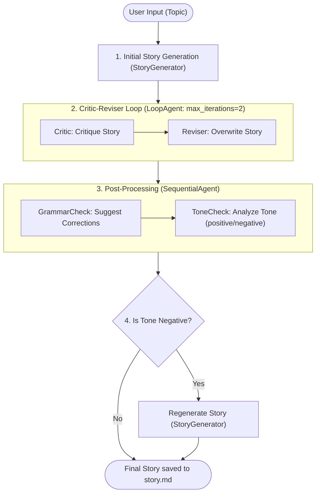

# Deterministic Multi-Agent Workflows (StoryFlow)

This guide examines the design pattern implemented in `storyflow.py`. It showcases how to leverage the **Google Agent Development Kit (ADK)** to build complex, structured, and deterministic agent chaining workflows. The script demonstrates how to combine specialized LLM agents with standard framework constructs (`LoopAgent` and `SequentialAgent`) to write, critique, revise, and QA a short story dynamically.

---

## 🏗️ Workflow & Orchestration Design

Rather than leaving agent behavior completely open-ended and autonomous (which can be unreliable), some applications require a strict, predictable chain of operations. 

The `StoryFlowAgent` is a custom orchestrator that subclassess the ADK's `BaseAgent`. It structures execution into four deterministic phases:



---

## 🔍 Code Walkthrough & Reference

The full implementation of the custom orchestrator and agent declarations is located in `storyflow.py`:

```python
import logging
from typing import AsyncGenerator
from typing_extensions import override
from dotenv import load_dotenv

load_dotenv()

from google.adk.agents import LlmAgent, BaseAgent, LoopAgent, SequentialAgent
from google.adk.agents.invocation_context import InvocationContext
from google.genai import types
from google.adk.sessions import InMemorySessionService
from google.adk.runners import Runner
from google.adk.events import Event
from pydantic import BaseModel, Field

# Configuration Constants
APP_NAME = "story_app"
USER_ID = "12345"
SESSION_ID = "123344"
GEMINI_2_FLASH = "gemini-2.0-flash"

# --- 1. Custom Orchestrator Class ---
class StoryFlowAgent(BaseAgent):
    """
    Custom orchestrator inheriting from BaseAgent.
    Manages custom flow control, loop execution, and state-based branching.
    """
    # Pydantic field annotations for nested sub-agents
    story_generator: LlmAgent
    critic: LlmAgent
    reviser: LlmAgent
    grammar_check: LlmAgent
    tone_check: LlmAgent

    loop_agent: LoopAgent
    sequential_agent: SequentialAgent

    # Required Pydantic configuration to support arbitrary non-Pydantic types
    model_config = {"arbitrary_types_allowed": True}

    def __init__(
        self,
        name: str,
        story_generator: LlmAgent,
        critic: LlmAgent,
        reviser: LlmAgent,
        grammar_check: LlmAgent,
        tone_check: LlmAgent,
    ):
        # Instantiate aggregate orchestrator patterns before super().__init__
        loop_agent = LoopAgent(
            name="CriticReviserLoop", sub_agents=[critic, reviser], max_iterations=2
        )
        sequential_agent = SequentialAgent(
            name="PostProcessing", sub_agents=[grammar_check, tone_check]
        )

        sub_agents_list = [
            story_generator,
            loop_agent,
            sequential_agent,
        ]

        super().__init__(
            name=name,
            story_generator=story_generator,
            critic=critic,
            reviser=reviser,
            grammar_check=grammar_check,
            tone_check=tone_check,
            loop_agent=loop_agent,
            sequential_agent=sequential_agent,
            sub_agents=sub_agents_list,
        )

    @override
    async def _run_async_impl(
        self, ctx: InvocationContext
    ) -> AsyncGenerator[Event, None]:
        """
        Custom orchestrator implementation logic.
        Executes sequential flows, loops, and conditional branches.
        """
        # Phase 1: Initial Story Generation
        async for event in self.story_generator.run_async(ctx):
            yield event

        # Error resilience check: ensure story exists in session state
        if "current_story" not in ctx.session.state or not ctx.session.state["current_story"]:
             return

        # Phase 2: Run Critic-Reviser Iterations
        async for event in self.loop_agent.run_async(ctx):
            yield event

        # Phase 3: Post-Processing Checks
        async for event in self.sequential_agent.run_async(ctx):
            yield event

        # Phase 4: State-Based Conditional Branching
        tone_check_result = ctx.session.state.get("tone_check_result")
        if tone_check_result and tone_check_result.strip().lower() == "negative":
            # If the QA agent detected a negative tone, regenerate the story from scratch
            async for event in self.story_generator.run_async(ctx):
                yield event


# --- 2. Defining Individual Sub-Agents ---

story_generator = LlmAgent(
    name="StoryGenerator",
    model=GEMINI_2_FLASH,
    instruction="Write a story (around 100 words) on topic: {topic}",
    output_key="current_story", # Persisted directly to ctx.session.state["current_story"]
)

critic = LlmAgent(
    name="Critic",
    model=GEMINI_2_FLASH,
    instruction="Review story: {{current_story}}. Provide 1-2 constructive sentences.",
    output_key="criticism",
)

reviser = LlmAgent(
    name="Reviser",
    model=GEMINI_2_FLASH,
    instruction="Revise story: {{current_story}} using criticism: {{criticism}}.",
    output_key="current_story", # Overwrites the original story slot in session state
)

grammar_check = LlmAgent(
    name="GrammarCheck",
    model=GEMINI_2_FLASH,
    instruction="Check grammar of: {current_story}. Output corrections list, or 'Grammar is good!'.",
    output_key="grammar_suggestions",
)

tone_check = LlmAgent(
    name="ToneCheck",
    model=GEMINI_2_FLASH,
    instruction="Analyze tone of: {current_story}. Output ONLY 'positive', 'negative' or 'neutral'.",
    output_key="tone_check_result",
)


# --- 3. Creating Custom Instance ---
story_flow_agent = StoryFlowAgent(
    name="StoryFlowAgent",
    story_generator=story_generator,
    critic=critic,
    reviser=reviser,
    grammar_check=grammar_check,
    tone_check=tone_check,
)
```

---

## 🛠️ Key Architectural Elements

### 1. Extends `BaseAgent`
For basic applications, you can instantiate standard agents like `LlmAgent` directly. However, for customized flows, you subclass `BaseAgent` and override its async implementation:
```python
@override
async def _run_async_impl(self, ctx: InvocationContext) -> AsyncGenerator[Event, None]:
```
Inside this generator, you control the flow by using `async for event in agent.run_async(ctx): yield event`. This yields events (like thoughts or model chunks) back to the main client in real time.

### 2. State Mapping & Dynamic Interpolation
ADK agents read from and write to a shared **Session State** dictionary:
- **`output_key`**: Specifies which key in the dictionary will store the agent's final text output (e.g., `output_key="current_story"`).
- **Brace Interpolation (`{key}` vs `{{key}}`)**:
  - **`{topic}` / `{current_story}`**: Dynamically formatted using the initial state dictionary when the agent run starts.
  - **`{{current_story}}` / `{{criticism}}`**: Standard double-brace syntax. The ADK framework interpolates these variables directly from the session state at runtime, guaranteeing they fetch the freshest state from previous steps (which is essential for loops!).

### 3. Loop Execution (`LoopAgent`)
The `LoopAgent` manages iterative processes:
```python
loop_agent = LoopAgent(name="Loop", sub_agents=[critic, reviser], max_iterations=2)
```
- It runs the `sub_agents` sequentially (Critic ➔ Reviser).
- Once the last sub-agent completes, it repeats the process.
- It stops when `max_iterations` (set to `2` here) is reached, or if a custom termination criteria is satisfied.

### 4. Sequential Execution (`SequentialAgent`)
The `SequentialAgent` is a straight-line orchestrator that executes a list of sub-agents in a given order:
```python
sequential_agent = SequentialAgent(name="PostProcessing", sub_agents=[grammar_check, tone_check])
```
It simplifies standard orchestration by grouping multiple independent check-ins under a single agent runner boundary.

### 5. Conditional Branching
In `_run_async_impl`, the orchestrator reads output values directly from `ctx.session.state`:
```python
tone_check_result = ctx.session.state.get("tone_check_result")
if tone_check_result and tone_check_result.strip().lower() == "negative":
    # Trigger conditional recovery
```
This demonstrates how easy it is to combine declarative LLM agents with standard Python conditional constructs for robust, self-healing agent pipelines.
